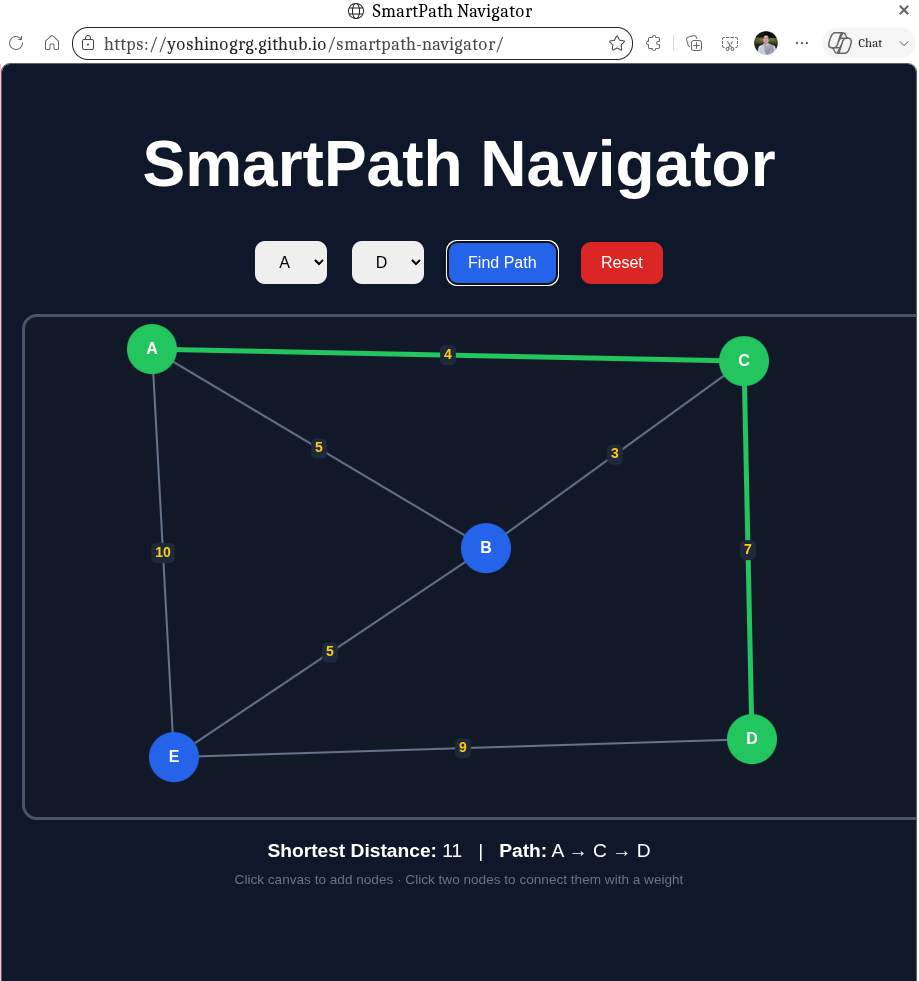

# SmartPath Navigator

SmartPath Navigator is a graph-based pathfinding visualizer built using Data Structures and Algorithms concepts.

The project demonstrates how shortest path algorithms work in real-world navigation systems such as Google Maps, Uber, and delivery routing platforms.

---

# Features

- Interactive graph creation
- Dynamic node generation
- Weighted edge connections
- Shortest path visualization
- Dijkstra Algorithm implementation
- Canvas-based graph rendering
- Real-time route calculation

---

# Technologies Used

- HTML5
- CSS3
- JavaScript
- Graph Theory
- Dijkstra Algorithm
- Canvas API

---

# How It Works

The application models a map as a weighted graph.

- Nodes represent cities/intersections
- Edges represent roads
- Weights represent distances

The system computes the shortest possible route between two selected nodes using Dijkstra’s Algorithm.

---

# DSA Concepts Used

## Graphs

The map is represented using an adjacency list.

Example:

```js
A: { B: 5, C: 2 }

## Demo


